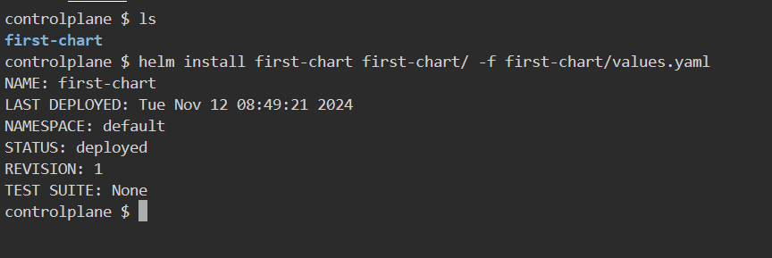
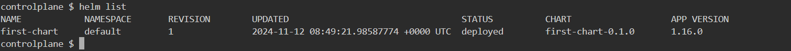
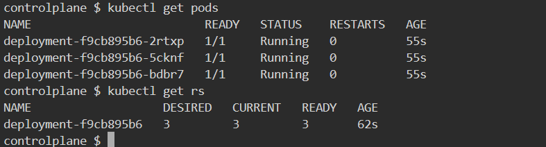
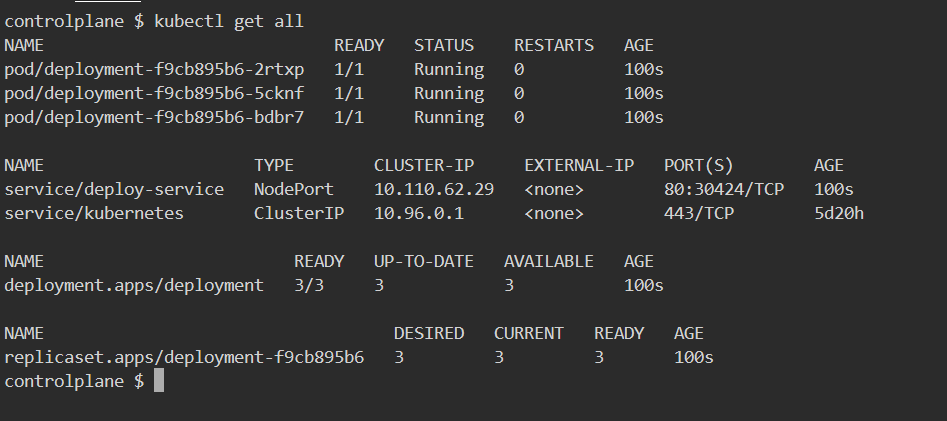
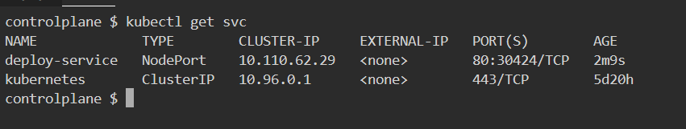
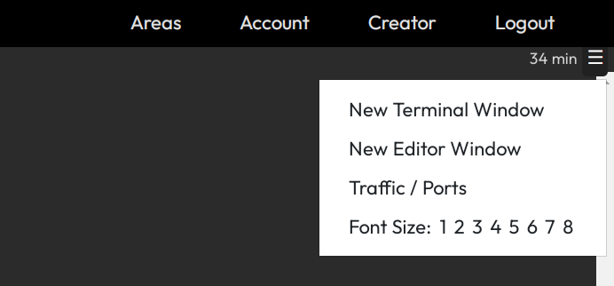
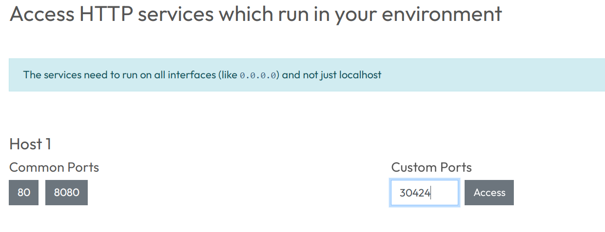
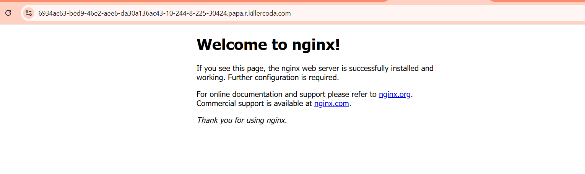
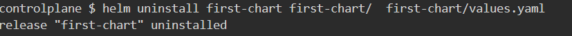

# K8S-Helm-chart
## Helm
**Helm** is a package manager for Kubernetes. It helps you define, install, and manage Kubernetes applications. Helm simplifies the deployment process of complex applications on Kubernetes by using pre-configured templates called **charts**.

[ReferHere](https://helm.sh/) for Official Docs and [ReferHere](https://helm.sh/docs/intro/install/) for Helm Installation.

1. Ensure you have creted kubernetes cluster if not then you can [ReferHere](https://learn.microsoft.com/en-us/azure/aks/tutorial-kubernetes-deploy-cluster?tabs=azure-cli#install-the-kubernetes-cli)

2. Helm Operates on K8s cluster,Make Sure helm in installed on your local machine, To install helm
```
curl -fsSL https://raw.githubusercontent.com/helm/helm/main/scripts/get-helm-3 | bash
```

3. 
    **Helm-chart for simple Deployment**
    ### Step:1 Creating Helm-chart ###
    ```
    helm create first-chart
    ```
     This will create a folder named `firsr-chart` with a standard Helm directory structure:

     ```
    first-chart/
        ├── Chart.yaml      # Metadata about the chart
        ├── values.yaml     # Default values for the chart
        ├── charts/         # Dependency charts
        ├── templates/      # Kubernetes templates
        └── ...
    ```
    ### Step: 2 Installing Helm-chart ###
    ```
    helm install first-chart first-chart/ -f first-chart/values.yaml
    ```
    
    
    ### Step:3 checking the list
    ```
    helm list
    ```
    
    ### Step:4
     - get the pod details
     ```
     kubectl get pods
     ```
     
     - Get the all details
     ```
     kubectl get all
     ```
     
    
     - Get the service
     ```
     kubectl get svc
     ```
     

    - To Expose it outside use the port
     
     

    - Now our Application i.e nginx is running 
     
    ### Step 4: Uninstall the helm
    ```
    helm install first-chart first-chart/ first-chart/values.yaml
    ```

    
    
  